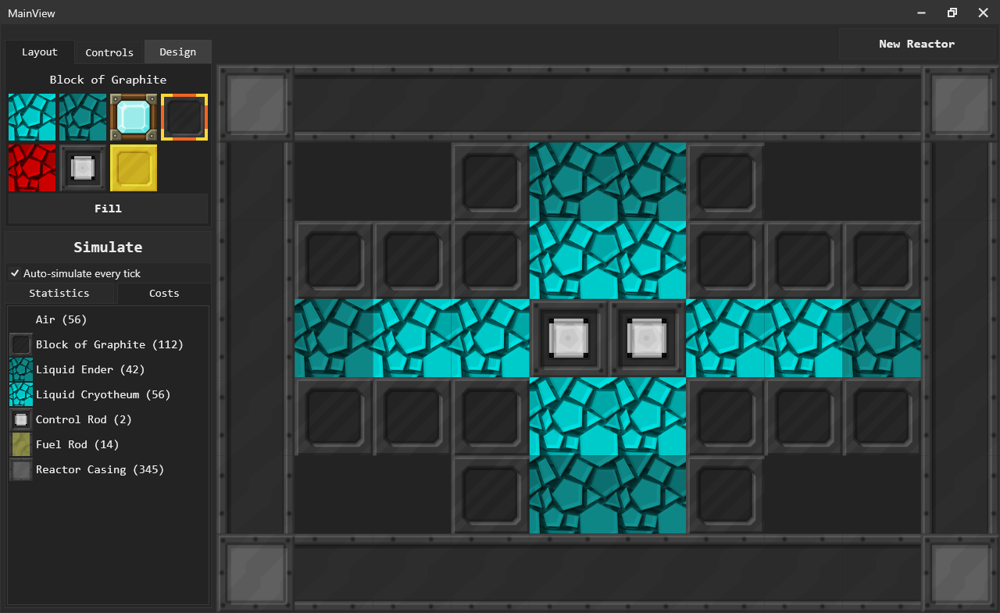

# BigReactorSimulator
a WIP simulator for the BigReactors mod, for simulating temps, effficiency with different patterns. not done yet

uses MVVM. right now im just making the view look nice and stuff... no simulating atm because tahts a bit harder

## Preview: (no simulation atm... just making the view look nice ;) might start making the simulator soon... but i kinda have to convert an entire java mod into c#

### how it works
there's a UserControl called a "TileControl"... tile meaning a square thing, like tiles in your kitchen i guess. and technically tiles like in minecraft, where a tile is a block because it is

each TileControl has an image inside it where the image's source binds to an ImageSource in the TileViewModel which all TileControls have as a data context. the TileControl also has code for selections, but the selection is "self contained"... its done using the mouse enter and leave events so theres no static variables needed. it also calls the OnClick method in the tileviewmodel if LMB is down while moving your mouse if the "ClickWhileDrag" sort of option is true.

the TileViewModel contains a TileType and when that changes it updates the icon/image source using a texture helper which locates textures based on the name (it loads all textures into ram during startup which is faster than loading images when you click

that OnClick method is abstract so it can be overridden, and it is overridden by the "ChangableTileViewModel" which uses the selected tile in the "TileSelector" to detemind which block to set in the reactor like coolants/fuel rods. the "PreviewTileViewModel" sets the selected tile in the "TileSelector". The "UnchangableTileViewModel" doesnt do anything when you click and disabled highlighting. this is used for the casing that shouldnt be editable

the BigReactorViewModel contains a list of all the tiles, including air. its a dictionary so it keys the tile position to the TileViewModel, except instead of using a TilePosition class it instead uses the x and y coordinates as a hash code (x + (y << 15)) (uses bitshifting because x5 + y11 and x11 + y5 would be the same hash code) which is faster tbh 
that dictionary syncs well with the "BigReactorControl"

the BigReactorControl is what shows all the tiles. it uses a grid and dynamically creates Row/Column definitions and uses the Grid definition dependency property stuff to set the TileControl's position within the row/column index... which means that you cant dynamically remove tiles; you have to create an entirely new reactor. but you can set the tile's type to air which works as removing them. 
to create a new reactor you simply clear all the tiles, row/column definitions and then re-add them but with different amounts as such.
