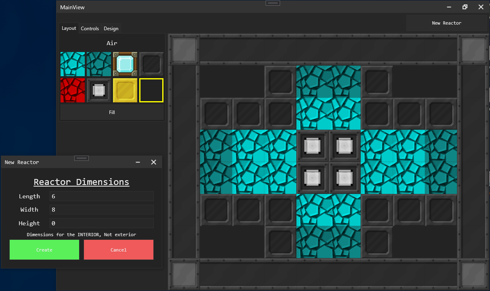

# BigReactorSimulator
a WIP simulator for the BigReactors mod, for simulating temps, effficiency with different patterns. not done yet

uses MVVM. right now im just making the view look nice and stuff... no simulating atm because tahts a bit harder

## Preview: (no simulation atm... just making the view look nice ;) might start making the simulator soon... but i kinda have to convert an entire java mod into c#

